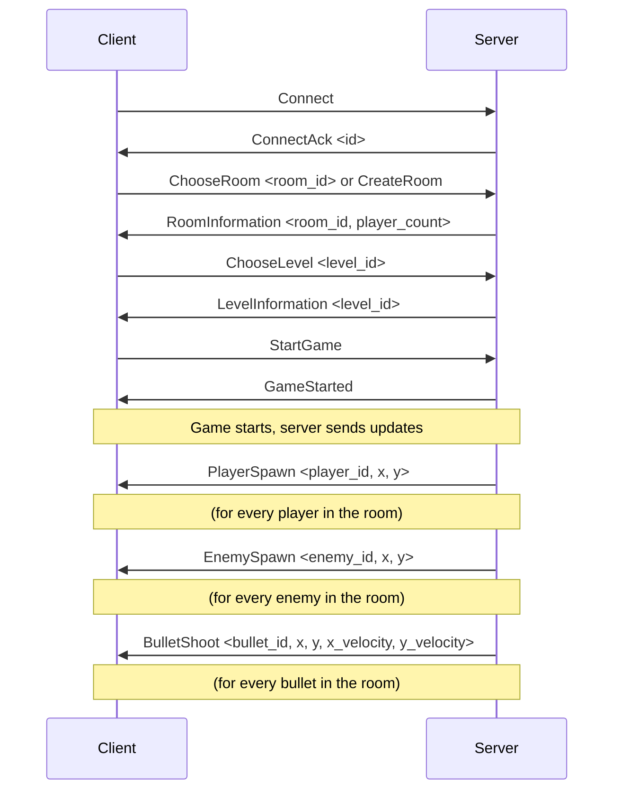
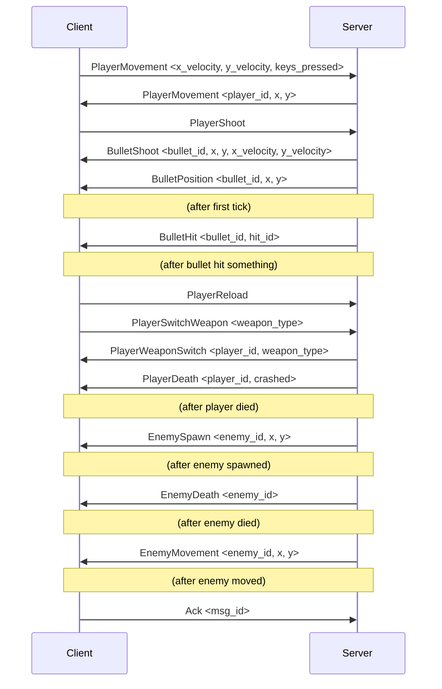

# Network communication protocol

## 1. Introduction

This document describes the communication protocol between the client and the server.

## 2. General rules

In this section, we describe the general rules that must be followed by the client and the server.

### 2.1. Networking protocol

The client and the server communicate using the UDP protocol. The server listens on port 4242.
The client will be the first to send a message to the server. The server will then store the client address somewhere, and will
continuously send updates to the client, at a rate of 64 updates per second (64 ticks), like CS:GO / CS2 servers.

### 2.2. Message format

#### 2.2.1. Message header

For the sake of simplicity, all our messages will be of a fixed length, decided for each message.
The goal is to have a message header that looks like this :

```
#pragma pack(push, 1)
struct NetworkMessageHeader {
    char magic[2]; // or u_int16_t magic;
    u_int16_t type;
    u_int64_t id;
};
#pragma pack(pop)
```
The header should not have any padding, thus the `#pragma pack` directives.
<br>
The magic will be hardcoded as {'R', 'T'}, or the 16bits unsigned integer 0x5254.
<br>
The type of the message will be a 16 bits unsigned integer, and will be used to determine the type of the message.
<br>
The id will be a 64 bits unsigned integer, and will be used to identify the message. It will be incremented by 1 for each message sent.
<br>
We do not include the length of the message here as it will be defined by the type of the message. The maximum length of a message will be 512 bytes.

#### 2.2.2. Message footer

The message footer will be a 16 bits unsigned integer, and will be used to check the integrity of the message. It will be hardcoded as {'T', 'R'} or the 16bits unsigned integer 0x5452.

```
#pragma pack(push, 1)
struct NetworkMessageFooter {
    char magic[2]; // or u_int16_t magic;
};
#pragma pack(pop)
```

### 2.3. Message sending

Both the client and the server will have to integrate a header and a footer to each message they send. They should also
have a global counter that will be incremented by 1 for each message sent. This will be used as the message ID, and will
be used to check for duplicate messages and to make sure they are handled in order, as UDP can sometimes mess with messages.

### 2.4. Message receiving

Both the client and the server will have to check the integrity of the messages they receive. They will have to check the
magic number of the header and the footer, and the message ID. They will also need to order messages by their ID, and
check for duplicate messages.

## 3. Communication

In this section, we describe the communication between the client and the server.
<br>Messages sent by the client are the messages received by the server, and vice-versa.

### 3.1. Messages sent by the client

This section describes the messages sent by the client to the server.

| Message Type | StructName |  Stored data | Description |
| ------------ | ------ | ----------- | ----------- |
| 0x0000 | `network::message::client::Connect` | ` ` | Used to connect (used by the server to store the client address) |
| 0x0001 | `network::message::client::Disconnect` | ` ` | Used to disconnect |
| 0x0002 | `network::message::client::ChooseRoom` | `u_int16_t room_id;` | Used to choose a room |
| 0x0003 | `network::message::client::ChooseLevel` | `u_int16_t level_id;` | Used to choose a level |
| 0x0004 | `network::message::client::StartGame` | ` ` | Used to start the game if not already started |
| 0x0005 | `network::message::client::CreateRoom` | ` ` | Used to create a room |
| 0x0006 | `network::message::client::LeaveRoom` | ` ` | Used to leave a room |
| 0x0010 | `network::message::client::PlayerMovement` | `float x_velocity;` <br> `float y_velocity;` <br> `bool keys_pressed[4]` | Used to move the player. The keys_pressed are : <br> `up (w, z, etc..) = 0` <br> `down (s, etc..) = 1` <br> `left (a, q, etc..) = 2` <br> `right (d) = 3` |
| 0x0011 | `network::message::client::PlayerShoot` | ` ` | Used to shoot a bullet. |
| 0x0012 | `network::message::client::PlayerReload` | ` ` | Used to reload a weapon. |
| 0x0013 | `network::message::client::PlayerSwitchWeapon` | `int16_t weapon_type;` | Used to switch weapon. |
| 0xFF00 | `network::message::client::Ack` | ` u_int64_t msg_id; ` | Used to let the server know that the client received a message. |

### 3.2. Messages sent by the server

This section describes the messages sent by the server to the client.

| Message Type | StructName |  Stored data | Description |
| ------------ | ------ | ----------- | ----------- |
| 0x0000 | `network::message::server::ConnectAck` | `size_t id;` | Used to acknowledge the connection (the ID should be used for debugging purposes) |
| 0x0001 | `network::message::server::RoomInformation` | `u_int16_t room_id;` <br> `u_int16_t player_count` | Used to tell the client which room they are in and with how many players |
| 0x0002 | `network::message::server::LevelInformation` | `u_int16_t level_id;` | Used to tell the client which level they are in |
| 0x0003 | `network::message::server::GameStarted` | ` ` | Used to tell the client that the game has started |
| 0x0004 | `network::message::server::GameEnded` | ` ` | Used to tell the client that the game has ended |
| 0x0010 | `network::message::server::PlayerSpawn` | `u_int16_t player_id;` <br> `float x;` <br> `float y;` | Used to indicate that a player spawned |
| 0x0011 | `network::message::server::PlayerDeath` | `u_int16_t player_id;` <br> `bool crashed;` | Used to indicate that a player died |
| 0x0012 | `network::message::server::PlayerMovement` | `u_int16_t player_id;` <br> `float x;` <br> `float y;` | Used to indicate that a player moved |
| 0x0013 | `network::message::server::PlayerWeaponSwitch` | `u_int16_t player_id;` <br> `int16_t weapon_type;` | Used to indicate that a player switched weapon |
| 0x0020 | `network::message::server::EnemySpawn` | `u_int16_t enemy_id;` <br> `float x;` <br> `float y;` | Used to indicate that an enemy spawned |
| 0x0021 | `network::message::server::EnemyDeath` | `u_int16_t enemy_id;` | Used to indicate that an enemy died |
| 0x0022 | `network::message::server::EnemyMovement` | `u_int16_t enemy_id;` <br> `float x;` <br> `float y;` | Used to indicate that an enemy moved |
| 0x0030 | `network::message::server::BulletShoot` | `u_int16_t bullet_id;` <br> `float x;` <br> `float y;` <br> `float x_velocity;` <br> `float y_velocity;` <br> `u_int8_t team` | Used to indicate that a bullet was shot |
| 0x0031 | `network::message::server::BulletPosition` | `u_int16_t bullet_id;` <br> `float x;` <br> `float y;` | Used to indicate that a bullet moved |
| 0x0032 | `network::message::server::BulletHit` | `u_int16_t bullet_id;` <br> `u_int16_t hit_id;` | Used to indicate that a bullet hit something (id is the entity that got hit, either player or enemy) |
| 0x0033 | `network::message::server::BulletDespawn` | `u_int16_t bullet_id;` | Used to indicate that a bullet despawned |

## 4. Communication diagrams

In this section, we describe the communication between the client and the server using diagrams.

### 4.1. From connection to game start


### 4.2. In-game communication

Packets sent by the server will be sent at a rate of 64 packets per second (64 ticks), and won't wait for the client to acknowledge them. Once the game is started, packets will start to be sent. The client will have to acknowledge them using the `Ack` packet. Here is a diagram of how the communication might look like :



